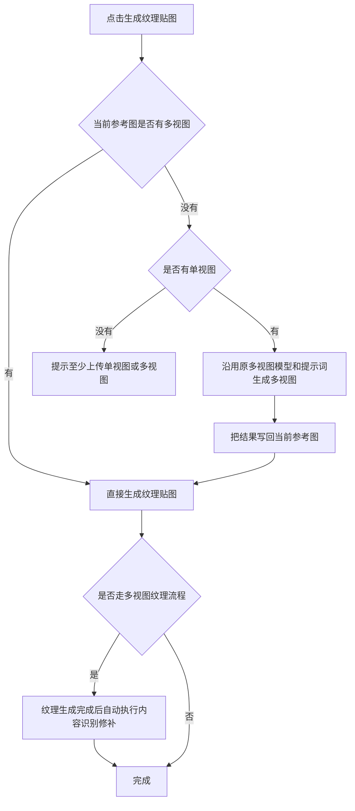
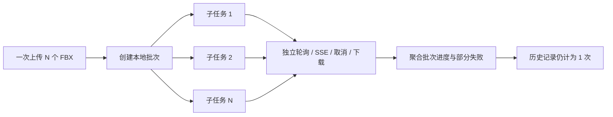

# Li3D：上次 Master 交付后的功能修改与远端性能算法合并说明

更新日期：2026-08-06

当前本地分支：`master`

当前本地提交：`a01c3c8`（合并远端性能阶段 4/5）

远端性能基线：`5e75ac0`（阶段 4）、`70cc97b`（阶段 5）

> 本文把上次 Master 功能交付后的本地改动，以及随后从远端 Master 合入的性能优化算法统一记录。未提交的本地工作区修改也包含在功能说明中；本文不代表这些修改已经再次推送到远端。

## 1. 本轮修改总览

本轮工作可分为六条主线：

1. 重构纹理生成的参考图与多视图流程。
2. 完善局部重绘、内容识别修补和图层会话逻辑。
3. 将自动拓扑升级为多模型独立批处理，并补全远端协议兼容。
4. 修复 UV/烘焙流程传递、页面刷新和任务状态残留问题。
5. 统一贴图、拓扑、UV、烘焙四阶段页面布局及认证恢复逻辑。
6. 合入远端性能阶段 4/5：异步 GPU 回读、持久 Worker 和 WebGPU 质量混合。

---

## 2. 参考图与纹理生成流程

### 2.1 参考图数据结构

- 原“参考图组”统一显示为“参考图”。
- 每条参考图记录由“单视图 + 多视图”组成，两者任意一个存在即可使用。
- 不再强制单视图必填；单视图和多视图都为空时，点击生成才进行明确提示。
- 支持新增多条参考图，并选择当前用于生成纹理的记录。
- 去掉图片文件名和冗余边框，采用紧凑卡片布局，提升同屏可见数量。
- 支持将图片直接拖入参考图区域，自动识别目标槽位并上传。

### 2.2 多视图自动补全

生成纹理时按以下顺序判断：



- 独立的“生成多视图”大面板已移除，能力并入参考图卡片。
- 用户仍可在参考图卡片中手动上传或主动生成多视图。
- 如果用户只传多视图，则跳过单视图补全，直接进入纹理生成。
- 主按钮统一显示为“生成纹理贴图”，不再显示“先补全多视图”等流程提示语。

### 2.3 多视图预设

- 预设改为与暗色 UI 一致的自定义下拉菜单。
- “预设 1”为默认 10 视角。
- “预设 2”为 14 视角。
- “自定义预设”默认只提供前、后、左、右、顶、底 6 个基础视角，用户可继续添加。
- 修复刷新页面后只显示占位缩略图、预设与实际视角列表不同步的问题。
- 修复“前/后”视角捕获错误，保证相机朝向与视角标签一致。
- 纹理生成模型固定使用 GPT 2，移除 GPT 2/Nano 2 选择框。

---

## 3. 局部重绘、内容修补与图层

### 3.1 局部重绘会话层

- 点击“局部重绘”后自动创建一个空白图层，并立即选中该图层。
- 用户可直接在新图层上绘制重绘区域，无需手动创建或切换图层。
- 退出局部重绘后再次进入，只要没有重新生成局部重绘结果，就继续复用并选中同一图层。
- 只有启动一轮新的局部重绘生成时，才创建下一张局部重绘图层。
- 底部工具栏入口与生成面板入口共用同一套会话逻辑，避免重复建层。

### 3.2 内容识别修补

- 多视图纹理生成成功后，自动在流程末尾触发内容识别修补。
- 修补请求与结果写层逻辑被拆成独立模块，便于手动修补和自动修补复用。
- 多次修补按层保存，避免第二次修补覆盖第一次结果。
- 图层记录增加修补/局部重绘会话标识，用于恢复正确的当前图层。

---

## 4. 自动拓扑多模型批处理

### 4.1 用户侧行为

- 支持一次上传多个 FBX，当前限制最多 20 个。
- 每个 FBX 单独调用完整自动拓扑任务，不把不同高模合并为一个模型。
- 单个模型失败不会中断其余模型；其余任务继续执行并正常交付。
- 页面只展示一条批次历史记录，但批次内保留全部模型、子任务状态和交付文件。
- 成功模型的 BLEND/FBX 可分别下载，并可继续传入 UV 流程。

### 4.2 批次编排



- 后端保存批次元数据、子任务归属和交付文件映射。
- 前端聚合完成数、失败数、总进度和部分失败提示。
- 取消批次时会对仍在运行的子任务执行取消，不影响已完成文件。
- 历史记录支持恢复批次并继续查看每个模型的结果。

### 4.3 远端资产协议兼容修复

曾出现远端返回：

```text
422 ASSET_PROTOCOL_INVALID
```

根因是多模型批次把来源文件名、任务信息拼入 `external_asset_id`，导致 ID 超过远端协议长度限制。现已改为：

- 批次 ID 使用固定长度、可打印 ASCII 字符。
- 子任务只附加短 `item-N` 后缀。
- 原始文件名只放入本地历史元数据，不再参与远端资产 ID。
- 不复用旧缓存中超过安全长度的外部 ID。

同时修复：

- 新任务开始时清除上一任务的主面板绑定，避免展示旧错误。
- 成功任务不再显示上一次外部请求错误。
- 部分失败仍保留明确错误信息，便于定位具体模型。

---

## 5. 四阶段工作流与页面状态

- 顶部流程统一为“贴图 → 拓扑 → UV → 烘焙”。
- 拓扑和 UV 页面接入与贴图、烘焙一致的 `WorkflowShell`，统一内容区、任务状态区和右侧历史栏位置。
- 修复 UV 页面模型文件名过长导致输入区和输出区横向溢出。
- UV 结果可从主任务或右侧历史记录传入烘焙低模槽位。
- 修复 UV 传入烘焙后必须手动刷新才能显示的问题，改为当前页面立即响应流程资产更新。
- 任务历史中的每次成功任务增加“传入下一流程”入口。
- 上游传入只创建下游输入副本，不回写或影响上游阶段。
- Atlas 凭证失效时增加强制刷新/重新认证处理，减少过期会话导致的资源服务失败。

---

## 6. 远端性能优化算法合并

本轮从远端 Master 合入性能阶段 4 和阶段 5，保留本地功能与 UI 行为。算法遵循以下优先级：

> 主线程持续出帧 > 4K 输出质量与确定性 > 后台完成速度。

### 6.1 阶段 4：异步 GPU 回读与 Worker 发布链路

阶段 4 主要解决 4K 烘焙时 GPU readback、像素翻转、质量图提取和 PNG 编码造成的主线程长帧。

#### 已合入算法

1. **异步 RenderTarget 回读**
   - 优先使用 `readRenderTargetPixelsAsync`，避免同步回读把主线程完整阻塞。
   - 保留同步兼容路径；异步 API 不可用或失败时自动回退。

2. **GPU 读回像素 Worker 化**
   - 将 Y 轴翻转、RGBA 重排和质量数据提取移入持久 Worker。
   - 通过 Transferable 转移像素缓冲区，减少主线程复制和 GC 压力。

3. **PNG 编码 Worker 化**
   - GPU readback 后的 PNG 打包和编码在持久 Worker 中执行。
   - 主线程只接收最终结果并进行原子发布。

4. **交互保护与分块让步**
   - 用户旋转、缩放或连续切换图层时，后台转换按块执行并主动让出预算。
   - 避免“后台任务多核满载”反而争抢内存带宽和 GPU 队列，拖慢视口。

5. **WebGPU 运行时能力探测**
   - 增加适配器/设备探测、自测、设备丢失监听和恢复。
   - 建立 RGBA CPU/Worker 与 WebGPU 的 A/B 基线。

#### 质量与降级保证

- CPU/Worker 回退保持相同分辨率和字节语义。
- WebGPU 不作为正确性的唯一依赖。
- 设备创建失败、设备丢失或自测失败时自动回退，不中断烘焙。

### 6.2 阶段 5：WebGPU Top-K 质量混合

阶段 5 主要把 4K 投影纹理最终质量 resolve 从 CPU 金标准迁移到 WebGPU Compute，同时保持可验证的像素一致性。

#### 已合入算法

1. **Top-K 投影质量 resolve**
   - WGSL Compute 接管候选纹理的最终质量选择与混合。
   - 包含 sRGB/linear 转换、质量一致性权重、dominance 选择和 coverage-confidence alpha。

2. **持久质量混合 Worker**
   - normal/overlay 数据通过 Transferable 进入持久 Worker。
   - Top-K 候选累积和顺序敏感 overlay 精确混合离开 UI 主线程。

3. **首次真实任务自动校准**
   - 每种 alpha 模式第一次运行时，同时计算 CPU 金标准与 GPU 结果。
   - 校准通过后，同一会话后续任务直接使用 WebGPU。
   - 校准失败或设备异常时立即回退 CPU Worker。

4. **双缓冲与原子发布**
   - 新结果完成并可采样后才替换旧纹理。
   - 避免中间空纹理、黑帧或尚未完成的结果提前显示。

#### GPU 发布质量门槛

| 指标 | 门槛 |
|---|---:|
| Alpha 通道 | 必须 0 字节差异 |
| RGB 最大通道差 | ≤ 1 |
| 总字节差异比例 | ≤ 0.00001 |

任一门槛不满足时，不发布 GPU 结果，自动使用 CPU Worker 金标准。

### 6.3 当前加速边界

已经进入 WebGPU/Worker 的部分：

- straight-alpha RGBA underlay 合成。
- Top-K 最终质量 resolve 与 coverage-confidence alpha。
- Top-K 候选累积和顺序敏感 overlay Worker 计算。
- GPU readback 翻转、质量图提取和 PNG 编码。

仍未完全 GPU 化的部分：

- 投影深度准备和逐层 UV WebGL 光栅。
- GPU→CPU readback/map 的同步边界。
- 接缝重建、UV gap/hole 修补、gutter 和透明区收尾。
- `ImageData`、`Blob`、`ObjectURL`、Three.js `Texture` 的最终创建与发布。

因此本轮提升重点是降低交互期主线程阻塞，并加速最终质量混合；尚不能表述为“全部 UV 烘焙已由 WebGPU 接管”。

### 6.4 性能诊断开关

- `?perfLab=1&perfOrbit=1`：打开性能实验室并持续旋转。
- `?perfQualityGpuAb=1`：每次质量混合执行 CPU/GPU A/B。
- `?perfQualityCpuGold=1`：强制发布 CPU Worker 金标准。
- `?perfWebGpuChunkMb=8`：调整 WebGPU RGBA 分块大小。
- `?perfWebGpuAb=1`：启用 WebGPU RGBA 路径 A/B。

---

## 7. 主要涉及模块

### 本地功能修改

- `apps/web/src/components/panels/GeneratePanel.tsx`
- `apps/web/src/components/panels/ReferenceGroupPicker.tsx`
- `apps/web/src/engine/contentAware/repairRequest.ts`
- `apps/web/src/engine/localRepaint/sessionLayer.ts`
- `apps/web/src/routes/AssetProcessingPage.tsx`
- `apps/web/src/routes/EditorPage.tsx`
- `apps/web/src/features/workflow/WorkflowShell.tsx`
- `apps/web/src/stores/referenceStore.ts`
- `apps/web/src/stores/layerStore.ts`
- `apps/server/src/routes/assetProcessing.ts`
- `apps/server/src/routes/history.ts`
- `apps/server/src/services/assetJobOwnership.ts`

### 远端性能算法

- `apps/web/src/engine/performance/gpuComputeBackend.ts`
- `apps/web/src/engine/performance/webGpuRgbaComposite.ts`
- `apps/web/src/engine/bake/gpuUvBakeRenderer.ts`
- `apps/web/src/engine/bake/gpuReadbackConversionWorker.ts`
- `apps/web/src/engine/bake/qualityBlendWorker.ts`
- `apps/web/src/engine/capture/gpuReadbackPngWorker.ts`
- `apps/web/src/engine/capture/renderTargetUtils.ts`
- `apps/web/src/workers/gpuReadbackConversion.worker.ts`
- `apps/web/src/workers/qualityBlend.worker.ts`
- `apps/web/src/workers/webGpuRgbaComposite.worker.ts`
- `apps/web/src/workers/encodeGpuReadbackPng.worker.ts`

---

## 8. 验证记录

远端性能阶段 4/5 合并后已完成：

- TypeScript 类型检查通过。
- ESLint 无错误；仅保留既有警告。
- Web 生产构建通过。
- 修复远端性能代码中两个 `prefer-const` 阻断项，不改变算法行为。

建议提交或再次上传 Master 前补做以下业务回归：

1. 单视图自动补多视图后继续生成纹理。
2. 只上传多视图直接生成纹理。
3. 多视图纹理生成后自动创建内容修补层。
4. 局部重绘退出再进入时复用会话图层。
5. 20 个 FBX 批处理、部分失败、取消和历史恢复。
6. 拓扑结果传 UV、UV 结果传烘焙，并确认目标页无需刷新。
7. 4K、14 投影层下执行 CPU/GPU A/B，确认质量门槛与回退路径。

## 9. 与远端服务同步时的必要事项

如果远端资产/拓扑服务尚未同步多模型协议，至少需要支持：

- 同一批次下多个独立子任务。
- 每个子任务独立状态、取消和交付文件。
- 部分失败的批次完成语义。
- 固定长度 ASCII `external_asset_id`，不要依赖原始文件名解析业务信息。
- 历史接口返回批次级与子任务级映射。

详细的多模型服务协议说明另见：`docs/MULTI_MODEL_RETOPOLOGY_REMOTE_SYNC.md`。
