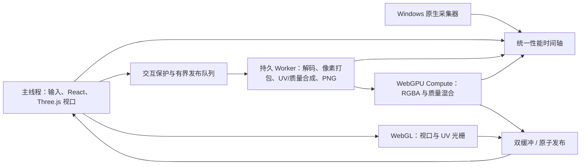

# Li3D 性能优化阶段 1–5 总结与后续路线

更新日期：2026-08-06  
核心优先级：主线程持续出帧 > 4K 输出质量与确定性 > 后台完成速度。

## 1. 总体架构

原则不是让所有 CPU 核“拉满”。后台任务在 Worker/GPU 上并行，但交互期间主动让出预算；否则内存带宽、GPU 队列和散热竞争同样会拖慢视口。跨 Intel、AMD、Apple Silicon 的默认实现使用浏览器标准 Worker、WebGL2 与 WebGPU，不绑定 CUDA。CUDA 可以作为 Windows/NVIDIA 可选原生后端，但不能成为正确性依赖。

## 2. 各阶段已完成内容

| 阶段 | 核心问题 | 已落地的算法与逻辑 | 质量保护 |
|---|---|---|---|
| 1 | 投影层开关和 UV 合成阻塞主线程 | 投影纹理数组打包与 UV 图层合成迁移到 Worker；投影层可见性改为轻量状态更新；非空纹理切换使用双缓冲，旧纹理保留到新纹理可采样 | 不改源图、投影矩阵、输出分辨率 |
| 2 | 快速连续操作重复计算、旧任务反压 | 持久 Worker 池；`latest-wins` 背压与过期任务取消；交互窗口推迟重型发布；图层栈与纹理数组复用；增加 UV 背压自动测试 | 最终状态必须等同最后一次用户输入；被替代任务不发布 |
| 3 | 缺少可解释的真实卡顿数据 | 浏览器 rAF、Long Task、WebGL/GPU timer、业务阶段时间轴；Windows 原生逐逻辑核、P/E 能效等级、GPU、显存、内存采集；4K S0–S5 压测面板；内容修补与图层切换埋点 | 监控低频采样，不在每帧触发 React 更新；报告记录分辨率和覆盖率 |
| 4 | 4K GPU readback、编码和主线程发布长帧 | 异步 `readRenderTargetPixelsAsync`；GPU 读回后的翻转/质量提取迁移 Worker；PNG 编码迁移持久 Worker；交互保护期间分块/让步；建立 WebGPU 能力探测、自测、设备丢失回退与 RGBA A/B 基线 | CPU/Worker 回退保持同分辨率同字节语义；测试开关可强制 A/B |
| 5 | CPU 金标准质量混合耗时大，GPU 路径覆盖不足 | WebGPU WGSL 接管 Top-K 质量 resolve 与 coverage-confidence alpha；normal/overlay 数据通过 Transferable 交给持久 Worker；Top-K 累积和 overlay 也离开主线程；每种 alpha 模式首次真实任务自动 CPU/GPU 校准，通过后同会话直接 GPU；设备失败或校准失败回 CPU | alpha 必须 0 字节差异；最大通道差 ≤1；差异比例 ≤0.00001；可强制 CPU 金标准或每次 A/B |

对应提交基线：阶段 1 `b1717f0`、阶段 2 `2033f3d`、阶段 3 `aa32d02`、阶段 4 `5e75ac0`；阶段 5 为当前工作区改动。

## 3. WebGPU 当前接管范围

### 已接管

- Worker 内 straight-alpha RGBA underlay 合成、分块上传、Compute、读回及 A/B 数据。
- 4K 投影质量混合的 Top-K 最终 resolve，包括 sRGB/linear 转换、质量一致性权重、dominance 选择和 coverage-confidence alpha。
- WebGPU 运行时探测、自测、生产 dispatch 计数、设备丢失恢复和 CPU Worker 回退。

### 已离开主线程但尚未进入 WebGPU

- 14 层 Top-K 候选累积：当前在持久 Worker 的 CPU 循环中。
- 顺序敏感 overlay 混合：当前在同一 Worker 中精确执行。
- GPU readback 的翻转、质量图提取和 PNG 编码：Worker 执行。

### 仍在主线程 / 共享渲染器的关键热点

- 投影深度准备以及逐层 UV 光栅的 WebGL renderer 状态切换。
- GPU→CPU `readPixels/map` 的同步边界；异步 API 只能减少阻塞，不能消除数据回读成本。
- 接缝重建、UV topology gap/hole 修补、gutter 和部分锐化/透明区收尾。
- 完成纹理的 `ImageData/Blob/ObjectURL/Texture` 创建和最终原子发布。

因此“WebGPU 已接管全部 UV 合成”目前不成立。它已接管两个大规模像素 resolve，但几何光栅、拓扑修复和发布仍是下一阶段重点。

## 4. 阶段 5 当前 4K 实测

硬件：Intel Core i7-13700KF（24 逻辑处理器）+ NVIDIA GPU；工业切割机器人；4K；持续旋转；完整 14 投影层、内容修补层与合并 UV 层。

| 场景 | 保护窗口 P95 / 最大 | 公共发布或全局最大 | 结论 |
|---|---:|---:|---|
| 0→14 投影层逐张加入 | 16.8 / 17.1ms | 发布最大 266.9ms | 交互期通过；最终发布未通过 |
| S2 连续投影层开关 | 16.8 / 16.9ms | 发布最大 66.7ms | 交互期通过；发布仍有可见尖峰 |
| S3 内容修补开关 | 16.8 / 16.9ms | S2/S3/S5 公共最大 83.4ms | 交互期通过；公共发布未通过 |
| S5 UV/投影切换 | 16.8 / 33.3ms | S2/S3/S5 公共最大 83.4ms | P95 通过；出现约两帧尖峰 |
| S4 14 层 + 修补层合成 UV | 33.3 / 283.6ms | 最差 `gpu-raster-readback` 283.6ms | 未通过 |

S4 分解：GPU bake 26752ms；depth 5391ms；raster/readback 9825ms；质量混合 5665ms；接缝 944ms；补洞 3567ms；gutter 948ms；PNG/编码约 2100ms。质量 Worker 本轮为 WebGPU，`overlayMs=215.2ms`，这些循环均不在 UI 线程。

质量校准：4K RGBA 共 67,108,864 字节，本轮 CPU/GPU 差异 30 字节，alpha 差异 0，最大差值 1，差异比例 `4.470348358154297e-7`，满足阶段 5 GPU 发布门槛。另一轮样本为 269 字节差异、alpha 0、最大差值 1、比例约 `4.01e-6`，同样通过。

结论：阶段 5 的 GPU 默认路径和质量闸门可用，但“所有操作稳定 60fps”尚未完成。当前阻断项不是质量 resolve，而是共享 WebGL 光栅/读回和最终发布长帧。

## 5. 下一阶段建议顺序

1. **拆除逐层 readback**：在独立 OffscreenCanvas/Worker WebGL2 或 WebGPU render pipeline 内完成多层 UV 光栅与 Top-K 累积，只在最终结果回读一次。预计这是 S4 最大收益点。
2. **GPU 常驻结果**：合成结果直接保留为 GPUTexture，视口先原子切换 GPU 纹理；持久化 PNG 在后台稍后完成。这样 UI 不等待 `mapAsync → JS buffer → Blob → decode → upload` 往返。
3. **拓扑修复 GPU 化**：接缝、gap/hole、gutter 按 UV island id/距离场实现 Compute 多 pass；CPU Worker 保留为兼容回退和 A/B 金标准。
4. **发布分帧与双缓冲完善**：所有 `ImageData/Texture` 创建和 disposal 纳入帧预算；只在新纹理上传完成且经过一帧验证后释放旧纹理，消除黑帧。
5. **真实 S1 自动生成链路**：从网络结果到 14 张解码、Worker 预处理、GPU 上传、原子发布逐张计时，而不仅是已有图层的 0→14 显示模拟。
6. **多硬件质量矩阵**：至少覆盖 Intel iGPU/NVIDIA、AMD、Apple M 系列；记录适配器、浏览器版本、CPU/GPU 差异与回退原因。WebGPU 校准门槛不因硬件放宽。

## 6. 运行与诊断开关

- `?perfLab=1&perfOrbit=1`：打开性能实验室并持续旋转。
- `?perfQualityGpuAb=1`：每次质量混合都运行 CPU/GPU A/B。
- `?perfQualityCpuGold=1`：强制发布 CPU Worker 金标准。
- `?perfWebGpuChunkMb=8`：调整 WebGPU RGBA 压测分块大小；只改变传输调度，不改变输出质量。
- `?perfWebGpuAb=1`：启用 WebGPU RGBA 路径 A/B。

阶段 5 的验收仍按《Li3D 视口流畅度标准测试流程》执行：每个场景至少 3 轮，以中位数和最差最大帧共同判定；任何 ≥100ms 主线程帧都阻断“稳定 60fps”结论。
