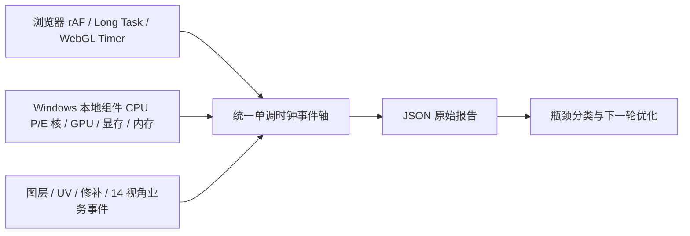
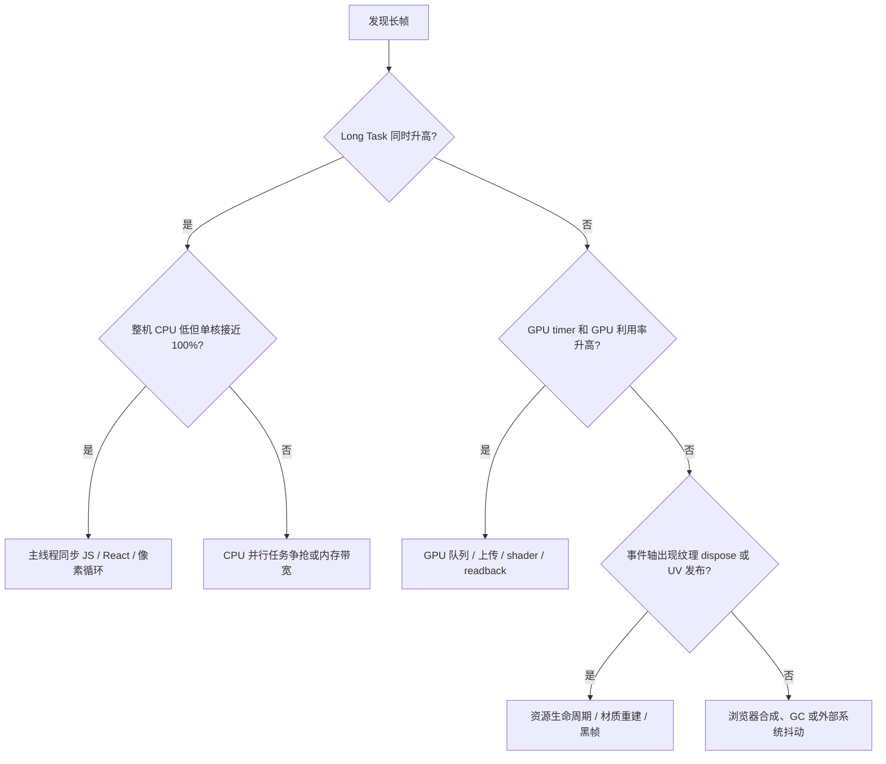

# Li3D 视口流畅度标准测试流程（Windows + 浏览器统一采集）

## 1. 测试目标

唯一最高优先级是持续出帧：模型连续旋转时，生成、图层开关、内容识别修补、UV 合成不得让视口停止响应。优化不得降低贴图分辨率、像素质量、投影精度或模型质量。



## 2. 采集器结构与扰动控制

- 浏览器端每帧只向预分配思路的环形缓冲追加一个帧耗时；不在 `requestAnimationFrame` 中触发 React 更新。
- 面板最多 2Hz 更新；Windows 原生数据最多 1Hz 拉取。
- GPU 指标优先使用 `nvidia-smi`，其他 Windows GPU 使用性能计数器；无法读取时明确显示不可用，不伪造数据。
- Windows 通过 CPU Set API 读取逻辑处理器能效等级，可区分 Intel P/E 核；AMD 等同构 CPU 仍逐逻辑核采样。
- 面板收起后只保留采样，不绘制大图表。正式结果必须比较“面板收起”和“面板展开”，监控开销不合格时先优化监控器。
- 浏览器扩展不是默认方案。扩展的注入脚本和消息通道会增加变量；Li3D 本地组件通过 loopback HTTP 提供原生数据，浏览器只异步读取。

## 3. 启动方式

开发环境打开项目 URL，并追加：

```text
?perfLab=1
```

自动持续旋转压力模式追加：

```text
?perfLab=1&perfOrbit=1
```

Windows 正式发行版由 `LIclick 3D Texture Local Component` 安装器携带原生采集器，不需要管理员权限或额外驱动。面板的“导出 JSON”包含浏览器帧、长任务、WebGL、业务事件、逐核心 CPU、GPU、显存和系统内存原始样本。

## 4. 固定测试条件

每轮必须固定：

1. 同一工业切割机器人项目、同一模型版本、同一相机起始位置。
2. 2K 和 4K 各测一组；不能动态降低分辨率或 DPR 来通过测试。
3. Chrome/Edge 版本、显卡驱动、电源模式、窗口尺寸保持一致。
4. 关闭录屏、系统更新和无关 GPU 程序；保留真实 Li3D 本地组件与后端。
5. 首次加载只用于预热；等模型、14 张图和 shader 全部加载后再开始记录。
6. 每个场景运行 3 次，报告中使用中位数，同时保留最差一次的最大帧时间。
7. 每次点击“清空”后等待 2 秒，收起面板，再执行场景；完成后等待 2 秒再展开读取结果。

## 5. 标准场景

| ID | 操作 | 持续旋转 | 必须记录 |
|---|---|---:|---|
| S0 | 不操作，空转 15 秒 | 是 | 监控开销基线 |
| S1 | 生成 14 个视角并自动创建、上传、显示全部投影层 | 是 | 每张解码、Worker、GPU 上传、首次显示时间 |
| S2 | 按 80–120ms 间隔连续开关 14 个不同投影层，再反向恢复 | 是 | 每次点击到首帧、最大帧、材质/纹理数量变化 |
| S3 | 执行内容识别修补；随后连续开关修补 UV 层 10 次 | 是 | 修补计算、UV 重组、黑帧/亮度突变、首帧 |
| S4 | 10–14 个投影层 + 1 个修补层合成到 UV | 是 | GPU bake、readback、PNG 编码、UV 发布、总耗时 |
| S5 | UV 图层与投影层显示模式连续切换 20 次 | 是 | 材质重建次数、纹理 dispose、最大帧 |

S1–S5 不允许在操作期间停止自动旋转。手工复测时，一人持续拖动视口，另一输入设备执行图层操作；自动化测试使用 `perfOrbit=1` 提供确定性的持续相机运动。

## 6. 验收阈值

以 60Hz 显示器为默认门槛：

| 指标 | 通过 | 阻断发布 |
|---|---:|---:|
| 帧时间 P95 | ≤ 20ms | > 25ms |
| 帧时间 P99 | ≤ 33.3ms | > 50ms |
| 最大帧时间 | ≤ 50ms | ≥ 100ms |
| >20ms 帧占比 | ≤ 1% | > 5% |
| >100ms 长帧 | 0 | 任意 1 帧 |
| 主线程 Long Task | 单个 < 50ms | 任意 ≥ 100ms |
| 监控器 P95 开销 | ≤ 0.3ms 或 ≤ 1% | > 1ms 或 > 3% |

质量门槛是硬约束：输出尺寸、位深、alpha、UV 覆盖率必须一致。确定性步骤使用逐像素比较；非确定性修补至少比较 UV 覆盖率、边缘 alpha、色差和固定区域截图，不允许通过降采样、少算视角或降低模型复杂度提速。

## 7. 单次执行步骤

1. 重启浏览器和 Li3D 本地组件，打开任务管理器仅确认没有异常后台负载，然后关闭任务管理器。
2. 打开工业切割机器人项目并等待 `Saved`、所有缩略图出现、GPU 显存稳定 5 秒。
3. 使用 `perfLab=1&perfOrbit=1`，记录硬件名称、逻辑核心数、P/E 能效等级、GPU 数据源。
4. 展开面板跑 S0 15 秒；记录数据。收起面板清空后再跑 S0 15 秒。两次差值就是监控 UI 扰动。
5. 点击“清空”，等待 2 秒，收起面板，执行一个且仅一个 S1–S5 场景。
6. 操作完成后继续旋转 2 秒，展开面板。截图顶部指标和统一事件时间轴。
7. 导出 JSON，文件名中写入场景、分辨率、轮次和提交号，例如 `S2-2K-R2-c94b0e8.json`。
8. 使用撤销或重新载入基准项目恢复完全一致的图层状态，再运行下一轮。
9. 每个场景 3 轮完成后，填写中位数、最差最大帧和质量校验结果。

## 8. 瓶颈判读



- 整机 CPU 低、某一逻辑核高、Long Task 高：把解码、像素合成、PNG 编码移到 Worker/WASM；减少 React 同步提交。
- GPU 利用率不高但帧仍卡：常见原因是 CPU→GPU 同步上传、`readPixels`、共享 renderer 状态切换或纹理 dispose，不应盲目增加 CUDA。
- GPU timer 高且 GPU 利用率高：使用视口优先级队列、分帧上传和独立离屏上下文；质量不变，只延长后台完成时间。
- 纹理开关时材质/程序数量改变：实现固定 shader 栈、纹理常驻、uniform visibility 位图，不重新编译材质。
- 修补层关闭出现黑闪：使用双缓冲和原子交换；新纹理确认完成首帧前不得释放旧 sampler。

## 9. 三个重点模块的优化验收

### 14 视角自动上贴图

Worker 池并行解码/遮罩/投影参数准备；主线程按每帧预算提交；GPU 上传采用有界队列；14 层准备完成后一次原子发布。对比优化前后 14 张源图 SHA-256、图层数、分辨率和投影矩阵必须完全一致。

### 连续投影层开关

纹理常驻 GPU，开关只更新 visibility bitset/uniform；禁止 Canvas 重打包、材质实例重建、shader 编译和纹理重新上传。验收时 WebGL program/texture 数量在开关前后保持不变。

### 内容识别修补

修补计算移入 Worker/WebGPU；UV 合成采用 latest-wins 背压；显示采用双缓冲和原子交换。关闭图层不得 dispose 当前正在采样的纹理。黑闪验收使用连续帧亮度差检测，并人工复核截图。

## 10. 优化迭代闭环

每个提交只解决一个已标记事件段，执行 `基线 → 修改 → 相同场景 3 次 → 质量比对 → 回归全部场景`。报告必须同时给出：提交号、硬件、场景、原始 JSON、优化前后 P95/P99/Max、后台总耗时和质量结论。只有帧稳定性改善且质量门槛通过，才能进入下一阶段。
