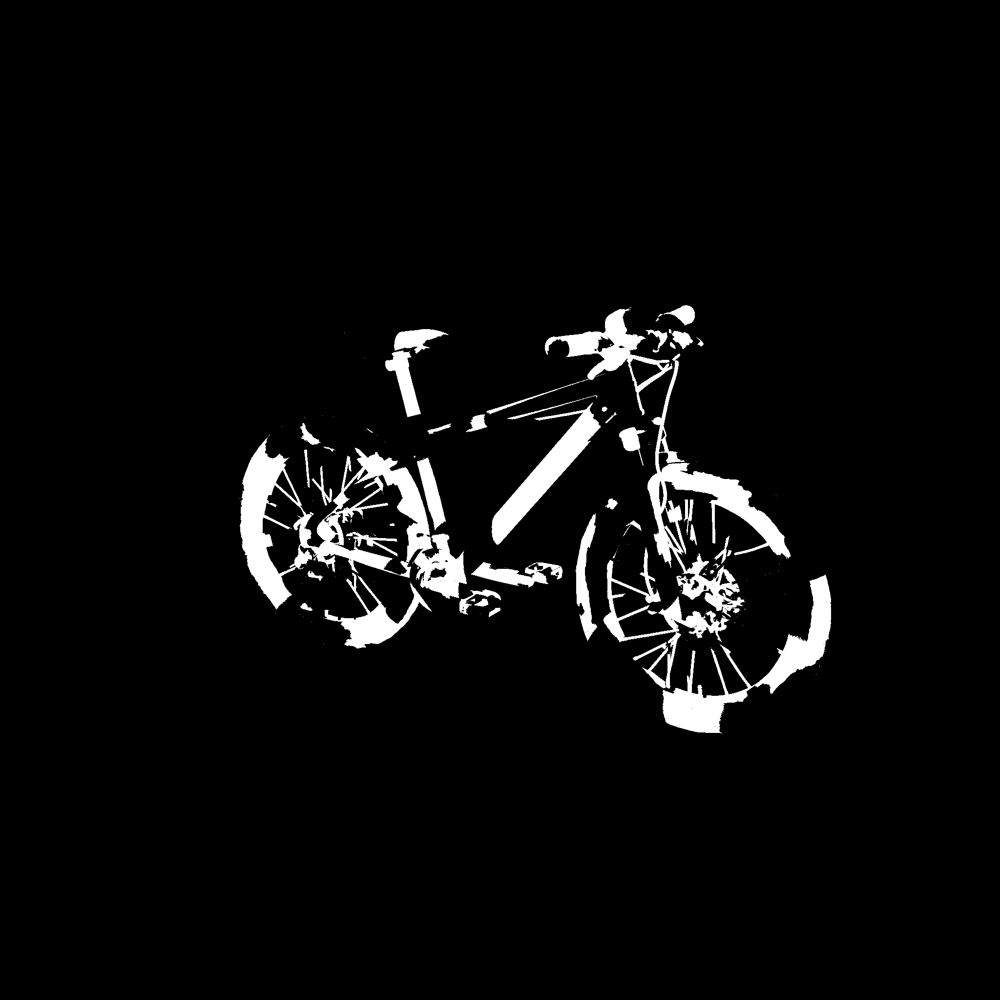
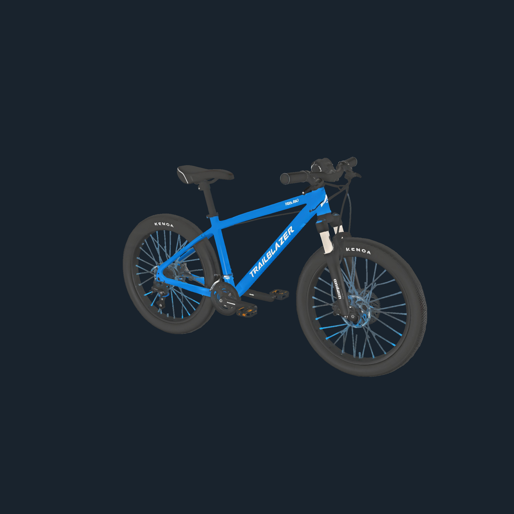
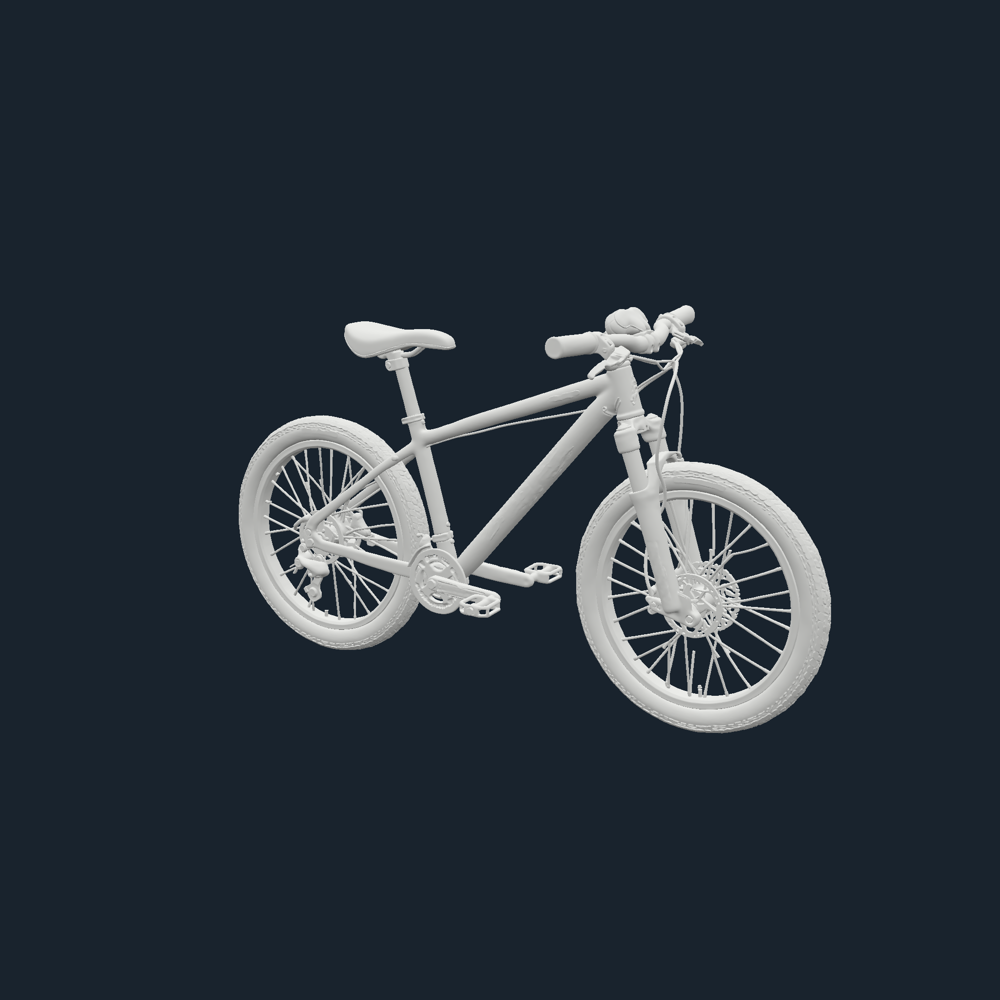

# 2026-09-29 纹理捕获优化实测

补充：[投影运行时深度／法线专项 A/B/C](runtime-README.md)；[飞书完整优化报告](https://lilithgames.feishu.cn/docx/TekRd1TZRo2GzAxYFqQc7TWqnxb)。运行时绘制现已采用整张 pass，保留深度→法线的呈现与交互门禁。下文第 1～4 项记录先前实验阶段，专项结果单独计量。

## 结论与采用范围

1. **采用：作者蒙版整张绘制。** 去掉 512px tile，提交前让出一次呈现帧。
2. **采用：当前效果图、白模整张绘制。** 保留原材质借用/恢复和驻留门禁；提示词干净视口预览、运行时深度/法线 256px 分块未改。
3. **采用：捕获读回改为任务让步。** 可见 renderer 仍一次只读 1MiB、并发深度 1，保留 Three PBO/fence；普通 UV 调用默认仍逐帧让步。
4. **有限采用：PNG 返回缓冲直接转移。** 去掉一份完整 PNG 的 slice 复制。未取消中间 PNG 编码/解码；倒序编码省 RGBA 缓冲的候选因白模变慢而撤回。

## 最终组合版：捕获开始到 PNG 就绪

| 2K 捕获 | 冻结旧版 ms | 最终版 ms | 减少 |
| --- | ---: | ---: | ---: |
| 作者蒙版 | 801.8 | 161.4 | 79.9% |
| 当前效果图 | 643.0 | 237.6 | 63.0% |
| 白模图 | 654.1 | 243.7 | 62.7% |

这三行是独立捕获阶段，不能相加当成用户整次生图提速。没有发起远端/付费生成，未测云端排队、推理和完整保存链路。

## 测试条件与口径

- 基线提交：`70a6507893be464f33df4e53423544c0d4832ab0`，与本次工作区候选交错执行。
- Edge 外部浏览器；Fullscreen API 生效、document visible/focus；实际页面 1241×1206，renderer 像素倍率 1；采样前空闲 rAF P95 16.8ms。
- 本机真实 `temp/li3dTests/Bicycle/Bicycle.glb`，1,857,094 三角面。使用构造的双色通道 UV 作者蒙版，冻结捕获相机；显示相机响应鼠标移动，视口持续渲染。
- 从真实源码提取 paintMaskCapture、captureFlatTarget、captureClayTarget 及材质实现。旧版渲染、读回、编码 Worker 均冻结；最终版调用工作区实现。夹具中的 resident 等待为空操作，因为此资产用原生模型材质，不是完整编辑器图层栈。
- 每场景 old/new/new/old/old/new/new/old，分别剔除各模式首轮预热后取三轮中位数；保留全部原始样本。PNG 解码/校验和证据写盘在计时之外。
- 最终 24 次 RGBA 对照差异均为 0；六张前后 PNG 的 SHA-256 配对相同，见 [image-sha256.json](image-sha256.json)。没有降低输出尺寸或采样质量。
- 输入数据是 pointermove 派发延迟，不是输入到像素呈现延迟。原始样本包含空采样/长帧，不移除异常值。仍需低配设备及真实多层投影工程验证，不能宣称全设备零卡顿。

## 图片证据

| 类型 | 原版 | 最终版 |
| --- | --- | --- |
| 作者蒙版 |  |  |
| 效果图 |  |  |
| 白模 |  |  |

图片为原始 2048×2048 捕获 PNG，没有通过截图或有损缩放替代原图。差异为零时不制造增强差异图，以完整文件哈希和逐 RGBA 校验为准。

## 分项实验

第 1/2 项单独采用、读回/编码未改时的结果见 [capture-stage12-results.json](capture-stage12-results.json)：蒙版 793.5→297.1ms，效果图 637.5→381.9ms，白模 627.2→374.1ms。

第 3 项独立读回：24 次逐字节一致；仍使用相同条带大小和并发限制。

| 读回尺寸 | 逐帧等待 ms | 任务让步 ms |
| --- | ---: | ---: |
| 2048×2048 | 260.0 | 100.1 |
| 2048×1495 | 189.0 | 78.0 |
| 4096×4096 | 1065.5 | 386.0 |

第 4 项最终直接转移 PNG 的 Worker 往返：

| 图片 | 原版 ms | 直接转移 ms |
| --- | ---: | ---: |
| 当前效果图 | 132.4 | 128.4 |
| 白模图 | 119.6 | 124.2 |

40 次编码结果 PNG 字节一致。该改动只确证少分配/复制一份完整编码文件，不宣称稳定加速。样例效果图/白模 PNG 字节数见 encode-results.json；这些是复制量，不是实测整个进程峰值内存。

**未采用候选：倒序编码。** 首轮白模 112.3→132.0ms，反向执行顺序复测 111.4→120.7ms；虽然可省 2K 的 16MiB RGBA 翻转缓冲，但不符合速度目标，已还原。效果图的小收益不用于掩盖白模退化。两轮结果见 encode-results-round1.json、encode-results-round2.json。

**作废的时序：内置浏览器初轮。** 虽然页面报告 visible/fullscreen，rAF 出现约 1000ms 间隔。只确认像素，不计入性能结论，见 iab-throttled-results.json。

## 审计、验证与回退

M03/M08，协作 M15。GPU 只改变提交/让步；CPU/Worker 保持完整像素、PNG 格式及生命周期；shader、颜色空间、相机、作者/远端 mask 阈值不变。无 Project/Layer/Capture Schema、Command/CAS、ownership 变化，无迁移。UV 合成和导出算法不变。默认 Trace 仍关闭，沿用既有 capture.readback/capture.encode。

定向捕获、flat 材质隔离、蒙版遮挡/所有权、条带读回、局部重绘输入、投影显隐回归与 typecheck/lint 已通过。完整 Web 回归 156 项全部通过，见 [web-regression.log](web-regression.log)。

回退：恢复对应入口的 tileSize；renderSceneToPngUrl 去掉 task 读回选择；PNG Worker 恢复返回缓冲 slice。历史资产无须重写。未提交、推送或部署。

## 证据索引与复现

- [最终捕获样本](capture-results.json)、[独立读回样本](readback-results.json)、[PNG 编码样本](encode-results.json)。
- [浏览器夹具源码快照](harness.zip)：解压到仓库 `.codex-tmp/`；在 `apps/web` 执行 `node ../../.codex-tmp/serve-mask-check.mjs`，打开 `http://127.0.0.1:4529/__mask-check`，全屏后分别运行三个按钮。
- 脚本按当前 HEAD 提取基线；复现原始对比需保持上述基线，并应用本次改动。输入为上述 Bicycle 文件；图像及 JSON 写入本目录。
- [最终全屏截图](fullscreen-results.png)。
