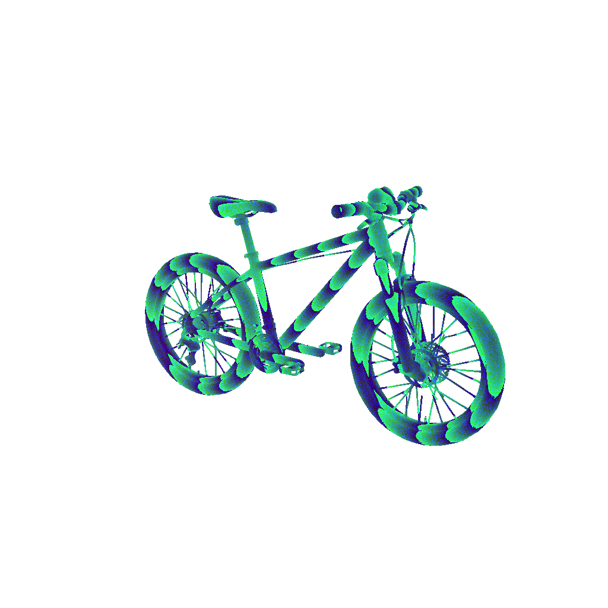
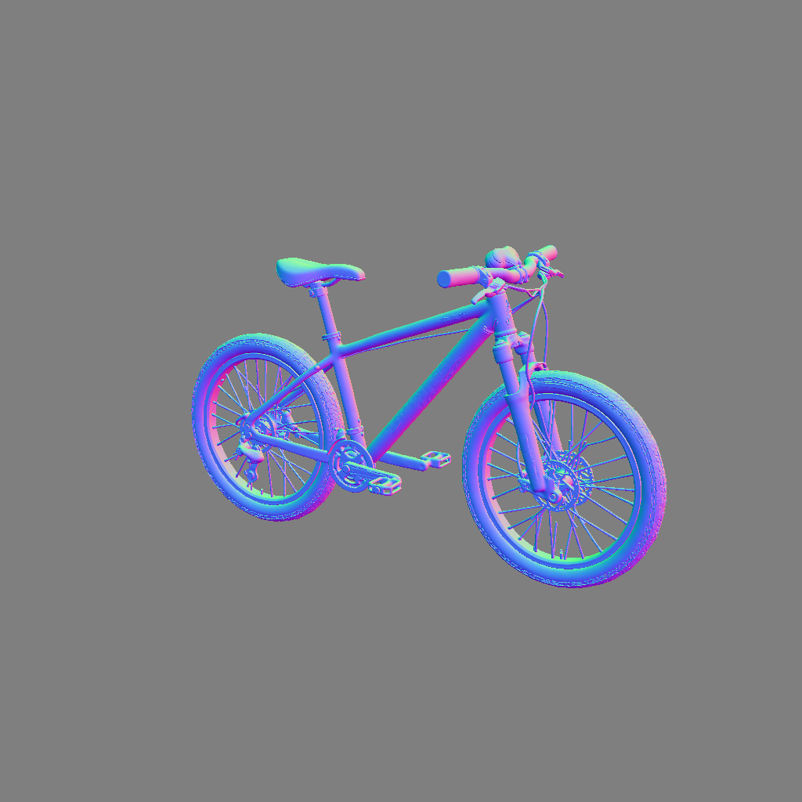

# 投影运行时深度／法线：专项 A/B/C

[飞书完整优化报告](https://lilithgames.feishu.cn/docx/TekRd1TZRo2GzAxYFqQc7TWqnxb)。本次完整 Web 回归重新执行，156 项全部通过，typecheck/lint 通过。

## 采用结论

采用 B：每个冻结 pass 整张提交，移除 256px 逐 tile 绘制与逐 tile fence；保留开始前的交互 idle 门禁，以及深度→法线的一次呈现等待和 idle 门禁。Three 异步 PBO 读回的必要同步、1MiB 条带及上一轮 task 让步不变。

C 在 B 上再删除两 pass 间的绘制帧等待。2K 双图仅多省约 14.6ms（2.8%），收益小，未采用。仅深度没有这个等待，B/C 代码路径相同，时间差属于采样波动。

## 实测数据

| 场景 | A：256px ms | B：整张＋等待 ms | C：整张无额外帧 ms | B 减少 |
| --- | ---: | ---: | ---: | ---: |
| Bicycle / 512² / 仅深度 | 72.4 | 24.4 | 23.4 | 66.3% |
| Bicycle / 1024² / 仅深度 | 321.5 | 71.6 | 69.9 | 77.7% |
| Bicycle / 1024² / 深度＋法线 | 653.0 | 150.6 | 133.7 | 76.9% |
| Bicycle / 2048² / 深度＋法线 | 2623.7 | 518.5 | 503.9 | 80.2% |
| 6 份重叠模型 / 1024² / 双图 | 653.8 | 155.7 | 143.4 | 76.2% |

基线 A 已包含前一轮 task 读回与 PNG 直接转移，本表不重复计算上一轮收益。每场景按 a/b/c/c/b/a/b/a/c/a/c/b 交错；每模式第一轮视为预热，后三轮中位数。统计从实际渲染函数进入至深度/法线 PNG 完成，含克隆、等待和编码；图片校验/保存不在计时内。旁路外层结果缓存以测量真实渲染，缓存命中场景不会获得同等收益。

Edge 全屏 1241×1206，renderer DPR 1。原始 Bicycle 1,857,094 三角面；压力组为 6 份略微错开的模型，共 11,142,564 三角面，可见视口持续绘制一份模型。512/1024 depth-only 覆盖常见入口；1024/2048 pair 覆盖可选法线调用。冻结矩阵、尺寸、depth packing、法线导数、背景及 shader 均相同。

## 正确性和交互

主实验 60 次＋压力补测 12 次，全部深度/法线 RGBA 差异为 0；保存的 A/B/C PNG 哈希配对相同。首轮 A 图的非背景像素数分别为 24,810、99,335、99,335、397,220、118,972，排除空图误判。RGB packed depth 的颜色是编码值，不能把它当普通灰度距离图。

主实验 2K A/B/C 均出现过 33.4ms 最大帧间隔，其他大多 16.8ms。首次压力场景未捕获到输入，不能用于输入结论；已独立补测：A/B/C 输入事件总数 145/31/33，最大帧间隔 16.8/16.9/16.8ms。A 每轮 pointermove 派发 P95 为 8.2/7.7/12.8/8.5ms，B 为 8.2/16.4/17.1/9.6ms，C 为 7.6/7.7/6.1/7.3ms。

短任务输入样本少且不等长，以上逐轮分位数不能合并为总体 P95，也不是输入到最终像素的延迟；B 有输入长尾波动，不承诺零交互代价。夹具的 idle callback 只记录门禁调用，未模拟持续按住鼠标导致的业务暂停；实际门禁顺序和 depth-only/失败清理由执行真实源码的回归测试覆盖。仍需在更弱硬件及完整编辑器复杂图层下观察。

## 实际调用与范围

SceneRoot 对缺失/旧深度修复通常 includeNormal=false；局部重绘遮挡校准也是 depth-only；UV bake 按请求选择法线，默认 false。已有合规作者深度与外层可见性缓存继续复用。没有新增任何法线生成或降低分辨率。

生产仅修改 createRuntimeProjectionDepth.ts：两处 tile 配置移除，深度开始前补一次 idle 检查，深度→法线的 paint/idle 顺序保留。原材质、矩阵、PNG、资源缓存和工程数据不变。回退恢复两处 tileSize=256 及其 idle callback 即可，无迁移。

## 图片与原始证据

| 输出 | A 原分块 | B 整张 |
| --- | --- | --- |
| 1024 深度 |  |  |
| 1024 法线 |  |  |

[主实验数据](runtime-results.json) · [压力补测数据](runtime-confirm.json) · [图片哈希](runtime-image-sha256.json) · [全屏截图](runtime-fullscreen.png) · [完整回归日志](runtime-regression.log)

本地代码与证据尚未提交、推送或部署；没有付费生成。正式发布前仍需最终 SHA 的 verify:prepush。
